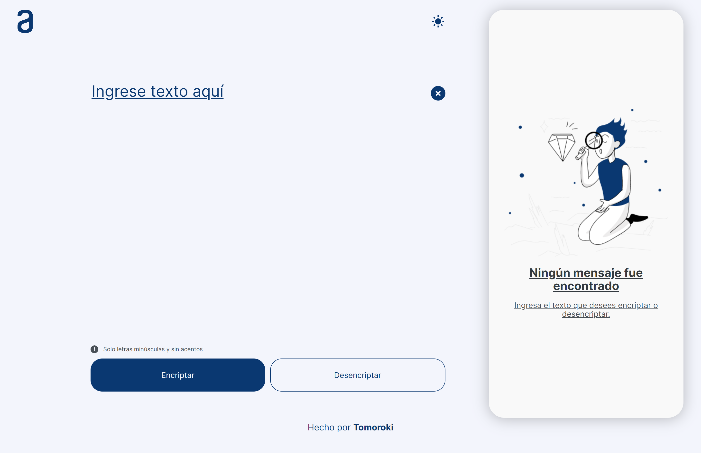
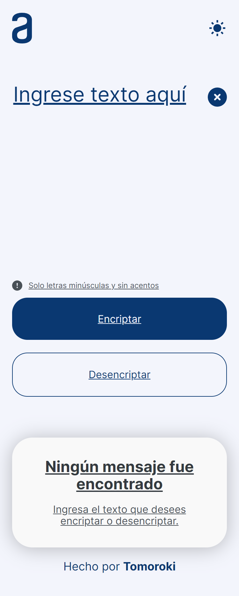

# Oracle Next Education - Encriptador de texto

Solución al desafio de Oracle en su programa ONE.

## Tabla de contenido

-   [Vista general](#vista-general)
    -   [El challenge](#el-challenge)
    -   [Screenshot](#screenshot)
    -   [Links](#links)
-   [Mi proceso](#mi-proceso)
    -   [Hecho con](#hecho-con)
-   [Autor](#autor)

## Vista General

### El challenge

¡Bienvenidos y Bienvenidas a nuestro primer desafío!

Vamos a trabajar en una aplicación que encripta textos, así podrás intercambiar mensajes secretos con otras personas que sepan el secreto de la encriptación utilizada.

Las "llaves" de encriptación son las siguientes:

La letra "e" es convertida para "enter"
La letra "i" es convertida para "imes"
La letra "a" es convertida para "ai"
La letra "o" es convertida para "ober"
La letra "u" es convertida para "ufat"

Requisitos:

-   Debe funcionar solo con letras minúsculas
-   No deben ser utilizados letras con acentos ni caracteres especiales
-   Debe ser posible convertir una palabra para la versión encriptada también devolver una palabra encriptada para su versión original.

Por ejemplo:
"gato" => "gaitober"
gaitober" => "gato"

### Screenshot

### Links

-   Solution URL: [Repositorio en Github](https://github.com/Tomoroki/encriptador)
-   Live Site URL: [github.io](https://tomoroki.github.io/encriptador/)

## Mi proceso

### Hecho con

-   Etiquetas HTML5 semánticas
-   Caracteristícas personalizadas de SCSS
-   CSS Flex
-   CSS Grid
-   Flujo de trabajo "mobile-first"
-   Javascript Vanilla

## Autor

-   Linkedin - [@jorgealeromero](https://www.linkedin.com/in/jorgealeromero)
-   Twitter - [@_tomoroki_](https://www.twitter.com/_tomoroki_)
